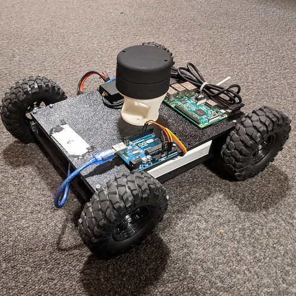
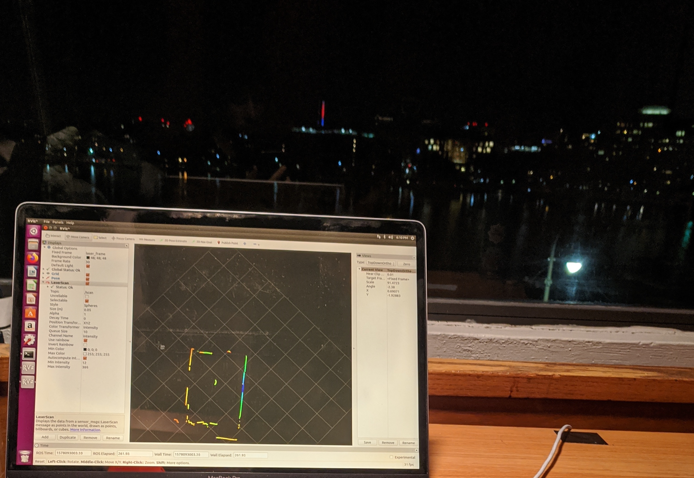
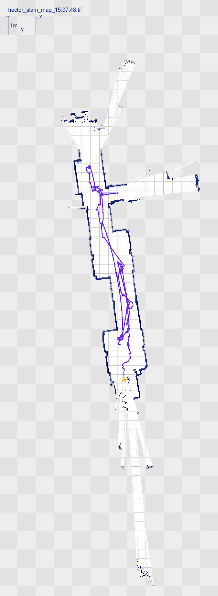

# Lidar+ROS+Raspberry Pi Robot



## 1. Building a robot.
------
This part is somewhat looser than the others. In a nutshell, find some motors, wheels, motor controllers, and some connecting materials. Throw them all at a wall and hope that the come together nicely. 

I have used RobotShop.com's:
* Scout platform
* Slightly stronger motors than the one it ships with. (Something like [this](https://www.robotshop.com/en/ghm-13-spur-gear-head-motor.html).)
* Cytron 10A 5-30V Dual Channel DC Motor Driver.
* YDLIDAR G2 Lidar.
* Raspberry Pi 3 Model B. (I could not install ROS on a Raspberry Pi 4 at this time, maybe you could!)


## 2. Installing ROS

ROS (Robot Operation System) is a framework that facilitates the use of a wide variety of "packages" to control a robot. Those packages range all the way from motion control, to path planning, mapping, localization, SLAM, perception, and more. ROS provides a relatively simple interface with those packages, and the ability to of course create custom packages.

Note: The Raspberry Pi 4 is more computationally capable than its predecessors. However, installing ROS on the Pi3 is currently (as of December 2019) easier, and allegedly more reliable.

### Get the disc image

I dowloaded the Ubuntu 16.04 Xenial with pre-installed ROS from [Ubiquity Robotics](https://downloads.ubiquityrobotics.com/pi.html). They have great instructions on how to install and download the image. The main points are:
* Download the image from the top of the page.
* Flash it to an SD card (at least 8GB). You can use Etcher, it works well.
* Connect to the WiFi network that starts with `ubiquityrobot`. Password is `robotseverywhere`.
* Go to Terminal, and connect to your Pi using `ssh ubuntu@10.42.0.1`. Password is `ubuntu`.
* Run `roscore` to make sure that things are working properly. If you get a warning/errors, try stopping ROS and starting it again with `killall -9 roscore`.

## 3. Remotely connecting to ROS
Something we would want to be able to do is to access the ROS communication messages from our laptop. There are a couple of steps to do here.
* Spin a Linux machine with ROS Kinetic Kame. Either a virtual machine or a real machine. You can use VMWare-Fusion with Ubuntu 16.04 or something similar. We will refer to that machine as the Observer machine. The robot is the Master.
* On the Master, find the `ROS_IP` and `ROSMASTER_URI`. These two things are the information both machines will need to communicate. Find the `ROS_IP` by running `ifconfig`. 

* I would add these lines to `.bashrc` on the Observer machine, or create a script to run them together. This is not required, but would make your life (potentially) easier in the long run (so you won't need to type those lines every time you'd want to connect to the robot :) ).

* On the Master (robot), run `roscore`. 
* On the observer, you now have access to the messages and topics that are on the Master. More on that soon.

* On the robot (the machine running `roscore`):
* * `ROS_IP` is its own IP.
* * `ROS_MASTER_URI` is HTTP://<its own IP>:11311.

* On the observer computer:
* * `ROS_IP` is its own IP.
* * `ROS_MASTER_URI` is the robot's IP

In this example (the IPs would probably be different in your network), on the robot, we set: `export ROS_IP=192.168.43.228 export ROS_MASTER_URI=http://192.168.43.228:11311`

On the observer laptop, we set: `export ROS_IP=192.168.43.123 export ROS_MASTER_URI=http://ubiquityrobot.local:11311`. This master URI looks different (but is actually the same under the alias). I believe that setting it to `192.168.42.228` would work (should be the same as the `.local`), but I did not test it.

## A couple of notes here:
* To make sure the communication works, I followed [this tutorial](http://wiki.ros.org/rviz/Tutorials/Markers%3A%20Basic%20Shapes) to publish basic shapes to rviz.
* I had to make the messages compatible with Indigo, following [an answer here](https://answers.ros.org/question/261071/rviz-client-md5sum-error/). (The solution with downloading the common msgs Indigo folder and using the `visualization_msgs` package foder in `catkin_ws/src`.)
* In rviz, make sure to set the frame to `my_frame` (if following tutorial).


### 4. Connecting to WiFi
A short step, to make sure both machines have internet connectivity. The information is taken from [this website](https://learn.ubiquityrobotics.com/connect_network).

* On the robot machine, `pifi add YOURNETWOKNAME YOURNETWORKPASSWORD`
* Restart the Pi, `sudo reboot`.
Now the Raspberry Pi will connect to your WiFi network on startup. To connect to it, connect your computer to the same network, and `ssh ubuntu@ubiquityrobot.local` with the password `ubuntu`.

Woo! Now both machines have internet, and can communicate over SSH.

## 5. Testing the lidar

This step was a bit of a doozy. It took me a while to figure out how to get the lidar to run. But I did! So hopefully you won't have to suffer too.

I am using the YDLIDAR G2 for this build. The first step is to install the necessary drivers. The driver is a ROS package.
* `cd catkin_workspace/src`.
* `git clone https://github.com/EAIROBOT/ydlidar_ros.git`.
* `catkin_make`
* Follow the directions from the repository, written below:
* * `roscd ydlidar_ros/startup`
* * `sudo chmod 777 ./*`
* * `sudo sh initenv.sh`
* Go back to your catkin workspace, and run `source devel/setup.bash`.
* `git checkout G2`. Move to the branch of your Lidar model.
* Run `catkin_make` again.

Test the lidar with `roslaunch ydlidar_ros lidar.launch`. Visualize the scans in Rviz, by adding the topic `/scan`. 

It may look something like this! Background may vary :)



## 6. ROS + Arduino; Getting them to talk to each other.
As we know, the Raspberry Pi is the "brain" of our robot, perceiving the environment and planning in it. The Arduino, is simply used to control the motors of the robot. It doesn't do much thinking. So our goal here, is to get commands from the Raspberry Pi to the Arduino, so it'll be able to tell the motors how to move, accordingly. In high level, what we do is install *rosserial*, a ROS module that enables Arduino communication, on both the Raspberry Pi and the Arduino.
* Following the steps from [the ROS website](http://wiki.ros.org/rosserial_arduino/Tutorials), we start with installing the package. `sudo apt-get install ros-kinetic-rosserial-arduino`, and then, `sudo apt-get install ros-kinetic-rosserial`. If you are using a ROS version different from Kinetic, change the word `kinetic` to your version.
* In the following commands, substitute `catkin_ws` with the name of your catkin workspace.
    ```cd catkin_ws/src
  git clone https://github.com/ros-drivers/rosserial.git
  cd catkin_ws
  catkin_make
  catkin_make install
  ```
* In your Arduino IDE, install the rosserial library. I found it the easiest to just do it from the IDE itself. Search for `rosserial` in the Library Manager and install it.

And that's it!

For a test run, try the [HelloWorld example](http://wiki.ros.org/rosserial_arduino/Tutorials/Hello%20World), from the examples included with the rosserial library. Flash the Arduino with it, and connect to the Raspberry Pi. To run it:

* On the Raspberry Pi `roscore`
* In a second Raspberry Pi terminal, `rosrun rosserial_python serial_node.py /dev/ttyACM0`. Change `ttyACM0` with the port of your Arduino. You can check the port by navigating to `~/dev/`, and observing which files disappear and re-appear when the Arduino is disconnected and connected.
* In a third terminal, `rostopic echo chatter` to see the messages being sent.

## 7. Installing Hector-SLAM
This part is exciting! We will now add the mapping and localization functionality to our robot. We use the Hector-SLAM package, since it enables us to create maps and localize ourselves with a Lidar alone. I found [this video by Tiziano Fiorenzani](https://www.youtube.com/watch?v=Qrtz0a7HaQ4) and the [official resources on the ROS website](http://wiki.ros.org/hector_slam/Tutorials/SettingUpForYourRobot) helpful for setting Hector-SLAM up.
* Clone the GitHub repository to your catkin workspace. Navigate to the `src` folder and run `git clone https://github.com/tu-darmstadt-ros-pkg/hector_slam.git`.
* [This may fail!, see sub-bullet for work-arounds] Build ROS by running `catkin_make` and then sourcing `setup.bash` with `source ~/catkin_ws/devel/setup.bash`.
* * If your build gets stalled, or seems to be very slow. Do two things.
* * * Increase swap space to 1GB. [Follow this tutorial for instructions.](https://www.digitalocean.com/community/tutorials/how-to-add-swap-space-on-ubuntu-16-04)
* * Run the build with `catkin_make -j2`

We need to make a couple of modifications to the Hector SLAM tutorial files in order for them to work with our setup. We first take note of the transformations available to us on the `\tf` topic, and the reference frames they use.
* Spin the lidar node, with `roslaunch ydlidar_ros lidar.launch`.
* Check the communication on the `/tf` topic with `rostopic echo /tf`
* I get only one transformation:
```
---                                                                          
transforms:                                                                         
  -                                                                          
    header:                                                                  
      seq: 0                                                                 
      stamp:                                                                 
        secs: 1578619851                                                     
        nsecs: 284012533                                                     
      frame_id: "/base_footprint"                                            
    child_frame_id: "/laser_frame"
    transform:                                             
      translation:                                         
        x: 0.2245                                          
        y: 0.0                                             
        z: 0.2                                             
      rotation:                                            
        x: 0.0                                             
        y: 0.0                                             
        z: 0.0                                             
        w: 1.0                                             
---                        
```
So we see that we have only two frames. Namely `/base_footprint` and `laser_frame`. We will update the file `~/catkin_ws/src/hector_slam/hector_mapping/launch/mapping_default.launch` to accommodate those.

* At the somewhat top of the file, change the first line to the second.

* * `  <arg name="odom_frame" default="nav"/>`

* * `  <arg name="odom_frame" default="base_footprint"/>`.

* At almost the very bottom of the file, change from/to:
* *   `<node pkg="tf" type="static_transform_publisher" name="map_nav_broadcaster" args="0 0 0 0 0 0 map nav 100"/>`
* *   `<node pkg="tf" type="static_transform_publisher" name="map_nav_broadcaster" args="0 0 0 0 0 0 base_footprint laser_frame 100"/>`

* Navigate to `~/catkin_ws/src/hector_slam/hector_slam_launch/launch/tutorial.launch`, and change from/to
* *   `<param name="/use_sim_time" value="true"/>`
* * `  <param name="/use_sim_time" value="false"/>`

This should do the trick! Try it out!

* In a first terminal run the lidar with `roslauch ydlidar_ros lidar.launch`
* In a second terminal run Hector SLAM with `roslaunch hector_slam_launch tutorial.launch`

You should be able to see the results in Rviz. Choose the `/map` topic to visualize the map that was created.

## 8. Lower Level Robot Control (That's where the Arduino comes in!)
We now want to create a ROS package that would allow ROS communication to move the robot in the world. Again, [Tiziano Fiorenzani has a great video](https://www.youtube.com/watch?v=iLiI_IRedhI&t=194s) explaining the basics of what we are doing here. In a nutshell, we want to make a subscriber node that would run on the Arduino, and listen to the topic `/cmd_vel`. We would want to begin with sending commands from the keyboard to the robot.

To see what this topic is all about, run `rosrun teleop_twist_keyboard teleop_twist_keyboard.py`. In another terminal, run `rostopic info /cmd_vel` to see that this topic publishes the structure `geometry_msgs/Twist`. Run `rosmsg show geometry_msgs/Twist`,  to see the attributes of the message. They are a linear and angular commands. 

```
geometry_msgs/Vector3 linear
  float64 x
  float64 y
  float64 z
geometry_msgs/Vector3 angular
  float64 x
  float64 y
  float64 z

```

Let's create the ROS node on our Arduino. We would want to map values in precentages (that we get from `/cmd_vel`) to the range [0,255] that our motor controller understands.

The entirety of the code for this node lives on the Arduino. So we use this sketch, and upload it. This is a very very simple sketch, that only supports forward and stopping motion. Check out the GitHub repo for a full program.

```cpp

#if (ARDUINO >= 100)
#include <Arduino.h>
#else
#include <WProgram.h>
#endif

#include <ros.h>
#include <geometry_msgs/Twist.h>
// Pin variables for motors.
const int right_pwm_pin = 5;
const int right_dir_pin = A0;
const int left_pwm_pin = 6;
const int left_dir_pin = A1;
const bool left_fwd = true;
const bool right_fwd = false;

// Default_speed.
const int default_vel = 201;

ros::NodeHandle  nh;

void MoveFwd(const size_t speed) {
  digitalWrite(right_dir_pin, right_fwd);
  digitalWrite(left_dir_pin, left_fwd);
  analogWrite(right_pwm_pin, speed);
  analogWrite(left_pwm_pin, speed);
}

void MoveStop() {
  digitalWrite(right_dir_pin, right_fwd);
  digitalWrite(left_dir_pin, left_fwd);
  analogWrite(right_pwm_pin, 0);
  analogWrite(left_pwm_pin, 0);
}

void cmd_vel_cb(const geometry_msgs::Twist & msg) {
  // Read the message. Act accordingly.
  // We only care about the linear x, and the rotational z.
  const float x = msg.linear.x;
  const float z_rotation = msg.angular.z;

  // Decide on the morot state we need, according to command.
  if (x > 0 && z_rotation == 0) {
    MoveFwd(default_vel);
  }
  else {
    MoveStop();
  }
}
ros::Subscriber<geometry_msgs::Twist> sub("cmd_vel", cmd_vel_cb);
void setup() {
  pinMode(right_pwm_pin, OUTPUT);    // sets the digital pin 13 as output
  pinMode(right_dir_pin, OUTPUT);
  pinMode(left_pwm_pin, OUTPUT);
  pinMode(left_dir_pin, OUTPUT);
  // Set initial values for directions. Set both to forward.
  digitalWrite(right_dir_pin, right_fwd);
  digitalWrite(left_dir_pin, left_fwd);
  nh.initNode();
  nh.subscribe(sub);
}

void loop() {
  nh.spinOnce();
  delay(1);
}

```
We can control the robot from our laptop now! In separate terminal instances, run the following:
* Allow Arduino communication with `rosrun rosserial_python serial_node.py /dev/ttyACM0`
* Enable keyboard control with `rosrun teleop_twist_keyboard teleop_twist_keyboard.py`

To make our lives easier for the next time we run the teleop node, we can create a launch file!

## 9. Launch files!

Creating a launch file is pretty simple, and can be done following the documentation on ROS.org.
In our case, we end up with the following launch file to launch all the necessary nodes for keyboard teleoperation.

```
<launch>
  <node pkg="rosserial_arduino" type="serial_node.py" name="serial_arduino">
    <param name="port" value="/dev/ttyACM0" />
  </node>

  <node pkg="teleop_twist_keyboard" type="teleop_twist_keyboard.py" name="teleop_twist_keybord">  </node>


</launch>
```

I have placed this launch file in the directory `~/catkin_ws/src/lidarbot/launch`. Don't forget to `catkin_make` and `source devel/setup.bash`  !

We can now run the robot in a teleoperated mode with 

`roslaunch lidarbot lidarbot_teleop.launch `

## 9. Correcting angle offset.

When I was designing the Lidar mount that I ended up 3D printing, I failed to look through the datasheet and design in in a way such that the "forward" direction of the Lidar would actually point forward. Let's correct that.

Because of a lack of time, let's do a somewhat hack-y patch.

Navigate to `/catkin_ws/src/ydlidar/sdk/src/CYdLidar.cpp`, and change the function `void CYdLidar::checkCalibrationAngle(const std::string &serialNumber) {` to the following. We are simply overriding the angle offset value provided by the Lidar model.

```cpp
void CYdLidar::checkCalibrationAngle(const std::string &serialNumber) {
  m_AngleOffset = 0.0;
  result_t ans;
  offset_angle angle;
  int retry = 0;
  m_isAngleOffsetCorrected = false;

  float override_offset_angle = 140.0;

  while (retry < 2) {
    ans = lidarPtr->getZeroOffsetAngle(angle);

    if (IS_OK(ans)) {
      if (angle.angle > 720 || angle.angle < -720) {
        ans = lidarPtr->getZeroOffsetAngle(angle);

        if (!IS_OK(ans)) {
          continue;
          retry++;
        }
      }

      m_isAngleOffsetCorrected = (angle.angle != 720);
      m_AngleOffset = angle.angle / 4.0;
      printf("[YDLIDAR INFO] Successfully obtained the %s offset angle[%f] from the lidar[%s]\n"
             , m_isAngleOffsetCorrected ? "corrected" : "uncorrrected", m_AngleOffset,
             serialNumber.c_str());

      std::cout << "Overriding offset angle to " << override_offset_angle << "\n";
      m_AngleOffset  = override_offset_angle;
      return;
    }

    retry++;
  }
```

Great, our Lidar's arrow points forward now.

## 10. Save a map.

In separate terminals, run:

`roslaunch lidarbot lidarbot_teleop.launch`

`roslaunch ydlidar_ros lidar.launch `

`roslaunch hector_slam_launch tutorial.launch `

And open Rviz from another linux machine, if possible.

Now, as you'll be driving around the space (slowly! We want the map to be built accurately, so no need to give it a hard time doing so.) you'll see a map starting to be build in real time, in Rviz. The lighter colors are empty space, and the dark ones are obstacles.

When you think your map is sufficiently good, run the following:

`rostopic pub syscommand std_msgs/String "savegeotiff"`

This will save a .tif and a .tfw files in `~/catkin_ws/src/hector_slam/hector_geotiff/maps` directory.

The map will look something like this:



## Simple application, wall following.

We are done setting up our robot! It is SMORT and can drive on its own, and sense its environment. I will be updating [this Github repository](https://github.com/yoraish/lidar_bot) with code for some fun applications. The first thing on there is a wall following ROS package! 

Happy building!


<!-- Nexts: 

* Ask for trajectory from start to goal(rviz?) with nav_msgs and move_base
* Ros Node on the Arduino to be the controller - follow the trajectory (could be some sort of pure pursuit with a "buffer"y feeling (doesn't have to hit poses exactly, has threshold)). -->
